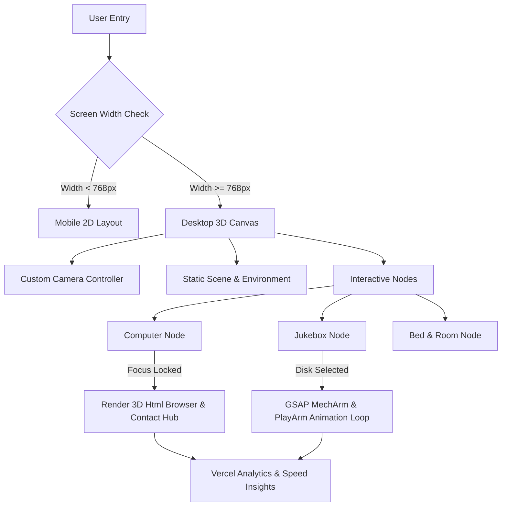

# GardZock Portfolio | Miguel Turco

[](https://nextjs.org/)
[](https://react.dev/)
[](https://threejs.org/)
[](https://www.typescriptlang.org/)
[](https://tailwindcss.com/)
[](https://vercel.com/)

---

## Overview

GardZock Portfolio is an interactive 3D web experience built with Next.js 16 (Turbopack), React Three Fiber, Three.js, and GSAP. It presents an immersive virtual room where users can navigate between real-time interactive nodes:

* **Interactive Workstation**: Built-in simulated Web Browser rendering dynamic projects, trajectory storylines, and a custom contact hub.
* **Jukebox Audio System**: Fully animated mechanical arm, needle controls, and spinning vinyl records playing audio tracks with an active equalizer.
* **Procedural Environment**: Dynamic lighting, custom fabric textures, responsive 3D camera controls, and smooth preset transitions.
* **Bilingual Localization**: Built-in i18n support supporting `pt-BR` and `en` with dynamic URL routing and locale resources.

---

## Performance & Optimization Metrics

The application undergoes continuous performance engineering to maintain high frame rates while minimizing memory footprint:

| Metric | Before Optimization | After Optimization | Improvement |
| :--- | :--- | :--- | :--- |
| **3D Model Binary Size** | 8.26 MB | 1.38 MB | **-83.3%** |
| **Desktop RAM Footprint** | ~450 MB | ~180 MB | **-60.0%** |
| **PMREM Environment Resolution** | High Mipmaps | 64 px | **-85.0% VRAM** |
| **DPR (Device Pixel Ratio)** | Up to 1.5 | Fixed 1.25 | **-30.0% Buffers** |
| **DOM 3D Overhead (`<Html>`)** | Always Mounted | Mounted on Focus | **Zero Idle Reflows** |

---

## System Architecture



---

## Core Technologies

* **Framework**: Next.js 16 (App Router with Turbopack)
* **3D Graphics Engine**: Three.js, `@react-three/fiber` (R3F), `@react-three/drei`
* **Animation & Motion**: GSAP (GreenSock Animation Platform)
* **Styling & UI**: TailwindCSS v4, Vanilla CSS Grid/Flexbox
* **Localization**: `next-i18next` (bilingual `pt-BR` & `en`)
* **Analytics**: `@vercel/analytics`, `@vercel/speed-insights`
* **Model Pipeline**: `@gltf-transform/cli` (Draco/WebP Texture compression)

---

## Interactive Features & Modules

### 1. Simulated 3D Browser & Contact Hub
* Features simulated Chrome tabs, address bar, smooth inner scroll, interactive storyline timelines, and milestone indicators.
* **Contact Module**: Integrated social hub featuring direct links to LinkedIn, GitHub, Instagram, and a one-click copyable email action card.

### 2. Jukebox & Mechanical Arm Sequence
* Precise GSAP timelines controlling multi-axis mechanical arm (`MechArm`), needle arm (`PlayArm`), and spinning vinyl disks.
* Real-time audio analyzer feeding data into a CRT terminal-styled visual equalizer.

### 3. Responsive Camera System
* Device-aware adaptive Field of View (FOV) matrix calculator maintaining proportion across ultra-wide, 16:9, tablet, and high-DPI displays.

---

## Search Engine Optimization (SEO)

* **Schema.org Structured Data**: Integrated `Person` and `WebSite` JSON-LD schemas.
* **OpenGraph & Twitter Cards**: Dynamic social preview metadata, locale alternates, and large image cards.
* **Native Navigation Maps**: Auto-generated `/sitemap.xml` and `/robots.txt` supporting multilingual routes (`/pt-BR` and `/en`).

---

## Project Setup & Installation

### Prerequisites
* Node.js >= 18.0.0
* `pnpm` >= 9.0.0 (recommended)

### Installation
```bash
# Clone the repository
git clone https://github.com/GardZock/gardzock-dev.git

# Navigate to project root
cd my-project

# Install dependencies using pnpm
pnpm install
```

### Development Server
```bash
pnpm dev
```
Open [http://localhost:3000](http://localhost:3000) in your browser.

### Production Build
```bash
pnpm build
pnpm start
```

### 3D Model Optimization Pipeline
If you update or replace `public/models/PortifolioV2.glb`, execute the automated compression script:
```bash
pnpm optimize-model
```

---

## Project Structure

```
my-project/
├── app/
│   ├── [lng]/
│   │   ├── layout.tsx         # Root Layout, Metadata & Vercel Analytics
│   │   └── page.tsx           # Main Entry Point
│   ├── components/
│   │   ├── computer/          # Workstation 3D & Chrome UI
│   │   ├── jukebox/           # Jukebox, Arms, Disks & Audio Equalizer
│   │   ├── scene/             # Canvas, Camera & Lighting Setup
│   │   └── JsonLd.tsx         # Schema.org Structured Data
│   ├── hooks/                 # Responsive Camera & Benchmark Hooks
│   ├── i18n/                  # Localization Json Bundles (pt-BR / en)
│   ├── robots.ts              # Native Robots.txt Generator
│   └── sitemap.ts             # Native Sitemap.xml Generator
├── public/
│   └── models/                # Optimized GLB Models & Keymaps
├── i18n.config.ts             # i18n Configuration
└── package.json               # Dependencies & Scripts
```

---

## Developer Contact

* **Developer**: Miguel Turco (@GardZock)
* **LinkedIn**: [linkedin.com/in/miguel-turco](https://www.linkedin.com/in/miguel-turco/)
* **GitHub**: [github.com/GardZock](https://github.com/GardZock)
* **Instagram**: [instagram.com/gardzock](https://www.instagram.com/gardzock)
* **Email**: [gardzock.contato@gmail.com](mailto:gardzock.contato@gmail.com)

---

```
// END OF FILE -- GARDZOCK PORTFOLIO 2026
```
